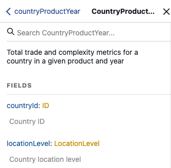

# Atlas of Economic Complexity GraphQL API Documentation

The Growth Lab's Atlas of Economic Complexity provides a GraphQL API for querying global trade data, economic complexity metrics, and country/product classifications.

**Base URL:** `https://atlas.hks.harvard.edu/api/graphql`

## Getting Started

The Atlas API uses GraphQL, which allows you to request exactly the data you need. All queries are sent via POST requests to the GraphQL endpoint. The API is publicly accessible and does not require authentication.

### Basic Request Structure

```bash
curl -X POST https://atlas.hks.harvard.edu/api/graphql \
  -H "Content-Type: application/json" \
  -d '{"query":"{ YOUR_QUERY_HERE }"}'
```

## Core Concepts

### Product Classifications

The API supports multiple goods classification systems:

- **HS92** - Harmonized System 1992 (default)
- **HS12** - Harmonized System 2012
- **SITC** - Standard International Trade Classification

The API currently supports a single services classification:

- **unilateral** - Unilateral services data (default)

#### Product IDs
Product IDs are internally-designated, numerical identification codes that do not correspond to published HS or SITC codes. These can be used as mappings between most queries with information regarding specific product codes available within their classification endpoints.

#### Product Levels

Most endpoints featuring product-level data will allow the user to supply a product level. This is a numerical representations of aggregation level within a specific product classification. For example, providing `4` in an `HS92` query would return products with a 4-digit HS code.

### Location Classifications

Locations are available in two different levels of aggregation in specific endpoints:

- **country** - Individual countries
- **group** - Country groups (continents, regions, trade blocs, etc.)

#### Country and Group IDs
Each location is identified with an internally-designated, numerical identification code. Wherever possible, this identifier has been designed to correspond to [a location's M49 code as desginated by the UN](https://unstats.un.org/unsd/methodology/m49/). Like product IDs, these can be used between endpoints to join data in queries.

## Best Practices and Restrictions

The Atlas API is specifically designed to support functionality for the Atlas of Economic Complexity. Public access is provided as a courtesy to users who may find it useful, but it is always possible that specific endpoints or data values may change suddenly and without warning. The Atlas API is best used to access data for stand-alone economic analysis, not to support other software applications.

The Atlas API currently enforces a **rate limit of 120 requests per minute**. We reserve the right to monitor usage of the Atlas API for abusive or potentially malicious behavior and further restrict or block access to specific users. Please be respectful of this public good and the associated work to maintain it as open access for all users.

- **Cache responses** when possible
- **Batch queries** using GraphQL's query composition
- **Request only needed fields** to reduce response size
- **Filter data within query** to reduce response size (e.g., only request data for a specific country or a specific time period, rather than all records)
- **For bulk data downloads**, visit [our data downloads page within the Atlas](https://atlas.hks.harvard.edu/data-downloads) for pre-generated tables.

## GraphQL API Documentation

For complete documentation of available queries and endpoints, users can access the GraphiQL interface available by navigating to the [API URL](https://atlas.hks.harvard.edu/api/graphql) in a browser. Once in the GraphiQL interface, users should see a "Docs" menu in the top right of the page. By opening the Documentation Explorer, you can click through the base Query object into descriptions of the various fields available. This menu should provide a complete reference to available fields, parameters, and response object types available to users via the API.



## Example Queries

### 1. Get Country List with Basic Info

```graphql
{
  locationCountry {
    countryId
    iso3Code
    nameEn
  }
}
```

### 2. Get China's Economic Data (2015-2022)

```graphql
{
  countryYear(countryId: 156, yearMin: 2015, yearMax: 2022) {
    year
    gdp
    gdppc
    population
    exportValue
    importValue
    eci
  }
}
```

### 3. Get US Exports in 2022 (4-digit HS92)

```graphql
{
  countryProductYear(
    countryId: 840
    productClass: HS92
    productLevel: 4
    yearMin: 2022
    yearMax: 2022
  ) {
    productId
    exportValue
    exportRca
    globalMarketShare
  }
}
```

### 4. Get HS92 Product Information

```graphql
{
  productHs92(productLevel: 4) {
    productId
    code
    nameEn
    clusterId
    naturalResource
    greenProduct
  }
}
```

### 5. Get Bilateral Trade Between US and China (2015–2022)

```graphql
{
  countryCountryYear(
    countryId: 840
    partnerCountryId: 156
    yearMin: 2015
    yearMax: 2022
  ) {
    year
    exportValue
    importValue
  }
}
```

### 6. Get Regional Trade Groups

```graphql
{
  locationGroup(groupType: continent) {
    groupId
    groupName
    members
    exportValueSum
    gdpSum
  }
}
```

### 7. Get Product Complexity Over Time for Bananas

```graphql
{
  productYear(productId: 714, productLevel: 4, yearMin: 2015, yearMax: 2022) {
    productId
    year
    pci
    exportValue
  }
}
```

### 8. Get Brazil's Feasibility Metrics

```graphql
{
  countryProductYear(
    countryId: 76
    productLevel: 4
    yearMin: 2020
  ) {
    productId
    year
    exportValue
    exportRca
    distance
    cog
    normalizedPci
  }
}
```

## Additional Resources

- **Atlas Website:** https://atlas.hks.harvard.edu
- **Growth Lab Viz Hub:** https://growthlab.app
- **Growth Lab Website:** https://growthlab.hks.harvard.edu
- **Growth Lab GitHub Organization:** https://github.com/harvard-growth-lab

For specific issues not covered in available resources, please reach out to [growthlabtools@hks.harvard.edu](mailto:growthlabtools@hks.harvard.edu) for support.

## Citation

If you use this data in academic research, please cite:

> Growth Lab at Harvard University. "The Atlas of Economic Complexity."
> Web application. Harvard Kennedy School. https://atlas.hks.harvard.edu

*Last updated: January 2026*
